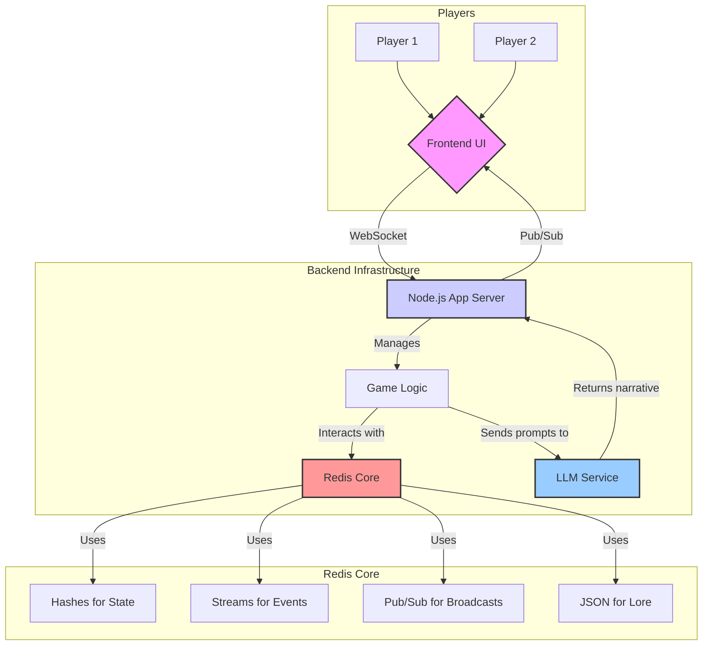
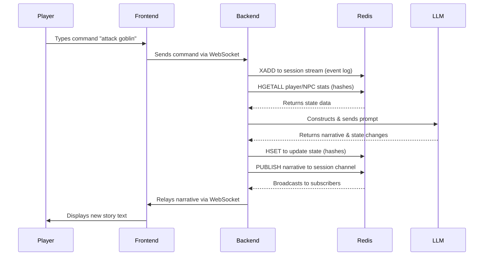

# 🐍 Real-Time AI Dungeon Master - Redis AI Challenge Submission

🚀 **AI-powered collaborative storytelling through real-time multiplayer adventures!** Built entirely around **Redis** as the high-performance real-time data layer, this project pushes the boundaries of interactive AI gaming.

> **Real-Time AI Dungeon Master** - The ultimate AI-powered multiplayer game, leveraging Redis for seamless real-time state management and dynamic storytelling.

**Built for the [Redis AI Challenge](https://dev.to/challenges/redis-2025-07-23?)** 🏆

> Competing in the **"Real-Time AI Innovators"** challenge prompt, demonstrating how Redis accelerates the future of AI through high-impact use cases like real-time feature streaming, semantic caching, and advanced state management.

## About This Project

This project was built for the **[Redis AI Challenge](https://dev.to/challenges/redis-2025-07-23?)** for the **"Real-Time AI Innovators"** challenge prompt. The goal was to build an innovative AI-powered application using Redis as the real-time data layer, going beyond simple chatbots to explore high-impact use cases like real-time multiplayer gaming with AI-driven storytelling.

### Challenge Submission Details

- **Challenge:** Redis AI Challenge
- **Prompt:** Real-Time AI Innovators
- **Focus:** Real-time multiplayer AI dungeon master using Redis for state management, event streaming, and pub/sub broadcasting
- **Technology Stack:** Redis, Node.js, React, OpenAI API, Socket.IO

### How This Project Demonstrates Redis AI Innovation

This project showcases how Redis accelerates the future of AI by implementing several high-impact use cases:

#### **1. Real-Time Feature Streaming for ML Workflows**

- **Redis Streams (XADD, XRANGE)** capture every player action as immutable events
- **Real-time event processing** feeds AI context for intelligent responses
- **Continuous learning** from player interactions to improve storytelling

#### **2. Semantic Caching to Optimize LLM Performance**

- **Redis Hashes (HSET, HGETALL)** store game state and context for rapid retrieval
- **Intelligent prompt construction** using cached game history
- **Reduced API calls** through context-aware response generation

#### **3. Real-Time State Management for AI Applications**

- **Redis Pub/Sub (PUBLISH, SUBSCRIBE)** enables instant narrative broadcasting to all players
- **Synchronized game state** across multiple players in real-time
- **Zero-latency updates** for immersive multiplayer experiences

#### **4. Advanced Redis Data Structures for AI Applications**

- **Redis Sets** track active players in each session with `SADD`, `SREM`, `SCARD`
- **Redis Keys** enable session discovery with pattern matching (`KEYS game:*:state`)
- **Redis DEL** provides session cleanup and data management
- **Redis Connection Management** with dual clients (main + subscriber) for optimal performance

#### **5. Beyond Simple Chatbots**

- **Complex game logic** with persistent world state
- **Multiplayer coordination** with real-time player tracking
- **Dynamic storytelling** that adapts to collective player actions
- **Session persistence** with automatic rejoining capabilities

This demonstrates how Redis can power sophisticated AI applications that go far beyond simple question-answer interactions, creating truly interactive and collaborative AI experiences.

## Features

### Core Game Features

- **Real-time Multiplayer**: Multiple players can join the same game session
- **AI Dungeon Master**: Powered by OpenAI GPT models for dynamic storytelling
- **Session Management**: Create and join game sessions via unique URLs
- **Session Discovery**: Browse and join active sessions with player counts
- **Session Persistence**: Automatic rejoining via localStorage and URL parameters
- **Session Deletion**: Remove inactive or unwanted sessions

### Redis-Powered Infrastructure

- **Redis Streams (XADD, XRANGE)**: Immutable event logging for game history
- **Redis Hashes (HSET, HGETALL)**: Fast game state management and caching
- **Redis Pub/Sub (PUBLISH, SUBSCRIBE)**: Real-time narrative broadcasting
- **Redis Sets (SADD, SREM, SCARD)**: Player tracking and session management
- **Redis Keys (KEYS)**: Session discovery with pattern matching
- **Redis DEL**: Session cleanup and data management

### Real-Time Communication

- **WebSocket Communication**: Real-time updates across all connected players
- **Cross-platform Synchronization**: All players see the same game state
- **Zero-latency Updates**: Immersive multiplayer experiences
- **Connection Recovery**: Automatic reconnection with session preservation

### AI Integration

- **Context-Aware Storytelling**: AI adapts to collective player actions
- **Multi-session AI Context**: Session-specific prompts and responses
- **Fallback Responses**: Graceful handling when AI services are unavailable
- **Error-Specific Handling**: Rate limits, quotas, and network issues
- **Real-time Narrative Generation**: Immediate broadcasting to all players

### Production-Ready Features

- **Docker Containerization**: Scalable deployment with docker-compose
- **Health Monitoring**: Redis connection status and system health checks
- **Rate Limiting**: Prevents AI API abuse and ensures fair usage
- **Error Handling**: Graceful degradation with comprehensive error messages
- **Environment Validation**: Pre-startup validation of all required services
- **Graceful Shutdown**: Proper cleanup of connections and resources

### User Experience

- **Modern UI**: Beautiful React interface with Tailwind CSS
- **Theme Support**: Dark/light mode with theme persistence
- **Toast Notifications**: User feedback for all actions
- **Loading States**: Visual feedback during AI processing
- **Error Boundaries**: Crash protection and recovery
- **Responsive Design**: Works on desktop and mobile devices

### Advanced Features

- **Player-Driven Narrative**: Collective actions influence the story
- **Real-time Collaboration**: Shared storytelling experiences
- **Event History Preservation**: Complete game state replay capability
- **Session State Caching**: Instant game resumption
- **Player Context Preservation**: Maintains context across reconnections

## Architecture

### System Architecture



### Data Flow (A Single Turn)



### Docker Architecture Flow

```flow
┌─────────────┐    ┌─────────────┐    ┌─────────────┐
│   Browser   │───►│   nginx     │───►│   React     │
│             │    │  (frontend) │    │   (frontend)│
└─────────────┘    └─────────────┘    └─────────────┘
                           │
                           ▼
                    ┌─────────────┐    ┌─────────────┐
                    │   Backend   │◄──►│    Redis    │
                    │  (Node.js)  │    │   (Cache)   │
                    └─────────────┘    └─────────────┘
```

## Prerequisites

- Node.js 18+
- Redis 7+
- OpenAI API Key

## Quick Start

### 1. Clone the Repository

```bash
git clone <repository-url>
cd realtime_ai_dungeon_master
```

### 2. Set Up Environment Variables

```bash
# Backend
cp backend/.env.example backend/.env
# Edit backend/.env and add your OpenAI API key

# Frontend
cp frontend/.env.example frontend/.env
```

### 3. Install Dependencies

```bash
# Backend
cd backend
npm install

# Frontend
cd ../frontend
npm install
```

### 4. Start Redis

```bash
redis-server
```

### 5. Start the Application

```bash
# Terminal 1 - Backend
cd backend
npm run dev

# Terminal 2 - Frontend
cd frontend
npm run dev
```

### 6. Access the Application

Open your browser and navigate to `http://localhost:5173`

## Docker Deployment

### Architecture Overview

The application uses a **multi-container Docker setup** with nginx as a reverse proxy:

#### **Frontend Container (nginx-based):**

- **Multi-stage build**: First builds React app, then serves with nginx
- **nginx.conf**: Handles routing and API proxying
- **Port 5173**: Serves the React application
- **API Proxy**: Routes `/api/*` requests to backend
- **WebSocket Proxy**: Routes `/socket.io/*` to backend

#### **Backend Container (Node.js):**

- **Port 3001**: Express server with Socket.IO
- **Health checks**: Built-in monitoring
- **Redis integration**: Session and state management

#### **Redis Container:**

- **Port 6379**: In-memory data store
- **Session storage**: Game state and player data
- **Event streaming**: Real-time updates

### Docker Architecture Flow

```flow
┌─────────────┐    ┌─────────────┐    ┌─────────────┐
│   Browser   │───►│   nginx     │───►│   React     │
│             │    │  (frontend) │    │   (frontend)│
└─────────────┘    └─────────────┘    └─────────────┘
                           │
                           ▼
                    ┌─────────────┐    ┌─────────────┐
                    │   Backend   │◄──►│    Redis    │
                    │  (Node.js)  │    │   (Cache)   │
                    └─────────────┘    └─────────────┘
```

### Why nginx.conf in Frontend?

The `nginx.conf` is in the frontend directory because:

1. **Multi-stage Docker build**: Frontend uses nginx to serve built React files
2. **API Proxying**: nginx routes `/api/*` requests to backend container
3. **WebSocket Support**: Proxies `/socket.io/*` for real-time communication
4. **SPA Routing**: Handles client-side routing for React Router
5. **CORS Avoidance**: Single domain for frontend and API calls

### Using Docker Files

#### **Backend Dockerfile:**

```dockerfile
FROM node:18-alpine
# Builds and runs the Node.js/TypeScript backend
# Exposes port 3001 with health checks
```

#### **Frontend Dockerfile:**

```dockerfile
# Stage 1: Build React app with Node.js
FROM node:18-alpine as builder
# Builds the React application

# Stage 2: Serve with nginx
FROM nginx:alpine
# Serves built files + proxies API calls
```

#### **docker-compose.yml:**

- **Redis**: Database for session storage
- **Backend**: Node.js API server (port 3001)
- **Frontend**: nginx serving React app (port 5173)

### Using Docker Compose

```bash
# Build and start all services
docker-compose up --build

# Run in background
docker-compose up -d

# Stop services
docker-compose down
```

### Manual Docker Build

```bash
# Backend
cd backend
docker build -t ai-dungeon-backend .
docker run -p 3001:3001 ai-dungeon-backend

# Frontend
cd frontend
docker build -t ai-dungeon-frontend .
docker run -p 5173:5173 ai-dungeon-frontend
```

## API Endpoints

### REST API Endpoints

#### **Game Session Management**

##### `POST /api/game`

Creates a new game session.

**Request:**

```json
{
  // No body required
}
```

**Response:**

```json
{
  "success": true,
  "sessionId": "abc123def4",
  "message": "Game session created successfully"
}
```

**Response Fields:**

- `success` (boolean): Always `true` on successful creation
- `sessionId` (string): Unique 10-character alphanumeric session identifier
- `message` (string): Human-readable success message

**Error Response:**

```json
{
  "success": false,
  "message": "Failed to create game session",
  "error": "Internal server error"
}
```

**Error Fields:**

- `success` (boolean): Always `false` on error
- `message` (string): Human-readable error message
- `error` (string, optional): Detailed error in development mode

**Status Codes:**

- `201` - Session created successfully
- `500` - Internal server error

---

##### `GET /api/sessions`

Retrieves all active game sessions.

**Request:**

```rest
GET /api/sessions
```

**Query Parameters:**

- None required

**Response:**

```json
{
  "success": true,
  "sessions": [
    {
      "sessionId": "abc123def4",
      "playerCount": 2,
      "createdAt": 1703123456789,
      "lastActivity": 1703123456789
    }
  ]
}
```

**Response Fields:**

- `success` (boolean): Always `true` on successful retrieval
- `sessions` (array): Array of active session objects
  - `sessionId` (string): Unique session identifier
  - `playerCount` (number): Number of active players (0-10)
  - `createdAt` (number): Unix timestamp when session was created
  - `lastActivity` (number): Unix timestamp of last activity

**Error Response:**

```json
{
  "success": false,
  "message": "Failed to get active sessions"
}
```

**Status Codes:**

- `200` - Sessions retrieved successfully
- `500` - Internal server error

---

##### `GET /api/sessions/:sessionId`

Gets detailed information about a specific session.

**Request:**

```rest
GET /api/sessions/abc123def4
```

**Path Parameters:**

- `sessionId` (string, required): 10-character alphanumeric session identifier

**Response:**

```json
{
  "success": true,
  "session": {
    "sessionId": "abc123def4",
    "playerCount": 2,
    "createdAt": 1703123456789,
    "lastActivity": 1703123456789,
    "players": ["socket_id_1", "socket_id_2"],
    "gameState": {
      "narrative": "You find yourself in a dark cave...",
      "events": [
        {
          "id": "event_1",
          "playerId": "socket_id_1",
          "command": "explore the cave",
          "narrative": "As you explore the cave...",
          "timestamp": 1703123456789
        }
      ],
      "currentLocation": "Dark Cave Entrance",
      "inventory": ["torch", "rope"],
      "health": 100,
      "experience": 50
    }
  }
}
```

**Response Fields:**

- `success` (boolean): Always `true` on successful retrieval
- `session` (object): Detailed session information
  - `sessionId` (string): Unique session identifier
  - `playerCount` (number): Number of active players
  - `createdAt` (number): Unix timestamp when session was created
  - `lastActivity` (number): Unix timestamp of last activity
  - `players` (array): Array of connected player socket IDs
  - `gameState` (object): Current game state
    - `narrative` (string): Current story narrative
    - `events` (array): Array of game events (max 50)
    - `currentLocation` (string): Player's current location
    - `inventory` (array): Player's inventory items
    - `health` (number): Player's health points (0-100)
    - `experience` (number): Player's experience points

**Error Response (404):**

```json
{
  "success": false,
  "message": "Session not found"
}
```

**Status Codes:**

- `200` - Session details retrieved successfully
- `404` - Session not found
- `500` - Internal server error

---

##### `DELETE /api/sessions/:sessionId`

Deletes a specific game session.

**Request:**

```rest
DELETE /api/sessions/abc123def4
```

**Path Parameters:**

- `sessionId` (string, required): 10-character alphanumeric session identifier

**Response:**

```json
{
  "success": true,
  "message": "Session deleted successfully"
}
```

**Response Fields:**

- `success` (boolean): Always `true` on successful deletion
- `message` (string): Human-readable success message

**Error Response (404):**

```json
{
  "success": false,
  "message": "Session not found"
}
```

**Status Codes:**

- `200` - Session deleted successfully
- `404` - Session not found
- `500` - Internal server error

---

#### **Health Check**

##### `GET /api/health`

System health check endpoint.

**Request:**

```rest
GET /api/health
```

**Response:**

```json
{
  "status": "healthy",
  "timestamp": "2024-01-15T10:30:45.123Z",
  "uptime": 3600.5,
  "redis": "connected",
  "environment": "production",
  "version": "1.0.0"
}
```

**Response Fields:**

- `status` (string): Health status (`healthy` or `unhealthy`)
- `timestamp` (string): ISO 8601 timestamp of health check
- `uptime` (number): Server uptime in seconds
- `redis` (string): Redis connection status (`connected` or `disconnected`)
- `environment` (string): Current environment (`development`, `production`, etc.)
- `version` (string): Application version

**Error Response (503):**

```json
{
  "status": "unhealthy",
  "timestamp": "2024-01-15T10:30:45.123Z",
  "error": "Redis connection failed"
}
```

**Status Codes:**

- `200` - System healthy
- `503` - System unhealthy

---

### WebSocket Events

The application uses Socket.IO for real-time communication. All events are prefixed with `game:`.

#### **Client to Server Events**

##### `game:join`

Join a game session.

**Request:**

```json
{
  "sessionId": "abc123def4"
}
```

**Request Fields:**

- `sessionId` (string, required): 10-character alphanumeric session identifier

**Validation Rules:**

- `sessionId` must be exactly 10 characters
- `sessionId` must be alphanumeric only
- Session must exist and be active

**Server Response:**

```json
{
  "sessionId": "abc123def4",
  "playerId": "socket_id_123",
  "timestamp": 1703123456789
}
```

**Response Fields:**

- `sessionId` (string): The session ID that was joined
- `playerId` (string): Unique socket ID for this player
- `timestamp` (number): Unix timestamp of join event

**Error Response:**

```json
{
  "message": "Session not found or inactive",
  "timestamp": 1703123456789
}
```

---

##### `game:command`

Send a command to the AI Dungeon Master.

**Request:**

```json
{
  "command": "explore the cave entrance"
}
```

**Request Fields:**

- `command` (string, required): Player's action command

**Validation Rules:**

- `command` must be non-empty string
- `command` must be trimmed of whitespace
- `command` maximum length: 1000 characters
- Player must be joined to a session

**Server Response:**

- No direct response
- AI narrative is broadcast via `game:update` event

**Error Response:**

```json
{
  "message": "Command cannot be empty",
  "timestamp": 1703123456789
}
```

---

#### **Server to Client Events**

##### `game:joined`

Confirmation that player successfully joined a session.

**Event:**

```json
{
  "sessionId": "abc123def4",
  "playerId": "socket_id_123",
  "timestamp": 1703123456789
}
```

**Event Fields:**

- `sessionId` (string): The session ID that was joined
- `playerId` (string): Unique socket ID for this player
- `timestamp` (number): Unix timestamp of join event

---

##### `game:player_joined`

Notification when another player joins the session.

**Event:**

```json
{
  "playerId": "socket_id_456",
  "sessionId": "abc123def4",
  "timestamp": 1703123456789
}
```

**Event Fields:**

- `playerId` (string): Socket ID of the player who joined
- `sessionId` (string): Session ID where player joined
- `timestamp` (number): Unix timestamp of join event

---

##### `game:player_left`

Notification when a player leaves the session.

**Event:**

```json
{
  "playerId": "socket_id_456",
  "sessionId": "abc123def4",
  "timestamp": 1703123456789
}
```

**Event Fields:**

- `playerId` (string): Socket ID of the player who left
- `sessionId` (string): Session ID where player left
- `timestamp` (number): Unix timestamp of leave event

---

##### `game:update`

AI narrative response broadcast to all players in the session.

**Event:**

```json
{
  "sessionId": "abc123def4",
  "narrative": "As you explore the cave entrance, you notice ancient runes carved into the stone walls. The air is thick with mystery and the faint sound of dripping water echoes from deeper within the cavern.",
  "playerId": "socket_id_123",
  "command": "explore the cave entrance",
  "timestamp": 1703123456789,
  "gameState": {
    "currentLocation": "Cave Entrance",
    "inventory": ["torch", "rope", "ancient key"],
    "health": 95,
    "experience": 75
  }
}
```

**Event Fields:**

- `sessionId` (string): Session ID where update occurred
- `narrative` (string): AI-generated story response (max 2000 characters)
- `playerId` (string): Socket ID of player who sent the command
- `command` (string): Original command that triggered the response
- `timestamp` (number): Unix timestamp of update event
- `gameState` (object, optional): Updated game state
  - `currentLocation` (string): Player's current location
  - `inventory` (array): Player's inventory items
  - `health` (number): Player's health points (0-100)
  - `experience` (number): Player's experience points

---

##### `game:error`

Error notification for various game-related issues.

**Event:**

```json
{
  "message": "Failed to process command. Please try again.",
  "timestamp": 1703123456789,
  "errorCode": "COMMAND_PROCESSING_ERROR"
}
```

**Event Fields:**

- `message` (string): Human-readable error message
- `timestamp` (number): Unix timestamp of error event
- `errorCode` (string, optional): Machine-readable error code

**Common Error Codes:**

- `SESSION_NOT_FOUND` - Session doesn't exist
- `COMMAND_PROCESSING_ERROR` - AI processing failed
- `RATE_LIMIT_EXCEEDED` - Too many commands
- `INVALID_COMMAND` - Command validation failed
- `CONNECTION_ERROR` - WebSocket connection issue

---

### Error Handling

All API endpoints return consistent error responses:

**HTTP Error Responses:**

- `400` - Bad Request (invalid parameters)

  ```json
  {
    "success": false,
    "message": "Invalid session ID format",
    "error": "Session ID must be exactly 10 characters"
  }
  ```

- `404` - Not Found (session doesn't exist)

  ```json
  {
    "success": false,
    "message": "Session not found"
  }
  ```

- `429` - Too Many Requests (rate limit exceeded)

  ```json
  {
    "success": false,
    "message": "Too many requests from this IP, please try again later.",
    "retryAfter": 900
  }
  ```

- `500` - Internal Server Error

  ```json
  {
    "success": false,
    "message": "Internal server error",
    "error": "Database connection failed"
  }
  ```

- `503` - Service Unavailable (health check failures)

  ```json
  {
    "status": "unhealthy",
    "timestamp": "2024-01-15T10:30:45.123Z",
    "error": "Redis connection failed"
  }
  ```

**Rate Limiting:**

- 100 requests per 15 minutes per IP address
- Returns `429` status with retry information
- Applies to all REST API endpoints
- WebSocket events have separate rate limiting

**WebSocket Error Handling:**

- Connection errors are handled gracefully
- Automatic reconnection attempts (exponential backoff)
- Session state is preserved during disconnections
- Error events include error codes for programmatic handling

---

### Authentication & Security

**CORS Configuration:**

- Configured for development and production origins
- Supports credentials for authenticated requests
- Methods: GET, POST, DELETE, OPTIONS

**Rate Limiting:**

- Prevents abuse with configurable limits
- Separate limits for REST API and WebSocket events
- IP-based rate limiting with configurable windows

**Input Validation:**

- All commands and session IDs are validated
- SQL injection protection through parameterized queries
- XSS protection through input sanitization
- Command length limits (1000 characters max)

**Error Sanitization:**

- Sensitive information is filtered in production
- Stack traces only shown in development mode
- Generic error messages in production

---

### WebSocket Connection Details

**Connection URL:** `ws://localhost:3001` (or your server URL)

**Connection Options:**

```javascript
const socket = io('http://localhost:3001', {
  transports: ['websocket', 'polling'],
  timeout: 60000,
  pingInterval: 25000,
  pingTimeout: 60000,
  reconnection: true,
  reconnectionAttempts: 5,
  reconnectionDelay: 1000,
  reconnectionDelayMax: 5000
});
```

**Connection States:**

- `connected` - Successfully connected to server
- `disconnected` - Connection lost
- `connecting` - Attempting to reconnect
- `error` - Connection error occurred

**Reconnection Behavior:**

- Automatic reconnection on connection loss
- Exponential backoff (1s, 2s, 4s, 8s, 16s)
- Maximum 5 reconnection attempts
- Session state preserved during reconnection

**Event Acknowledgment:**

```javascript
// Send command with acknowledgment
socket.emit('game:command', { command: 'explore cave' }, (response) => {
  if (response.success) {
    console.log('Command sent successfully');
  } else {
    console.error('Command failed:', response.message);
  }
});
```

## Development

### Backend Development

```bash
cd backend
npm run dev          # Start development server
npm run build        # Build for production
npm run test:phase1  # Run Phase 1 tests
```

### Frontend Development

```bash
cd frontend
npm run dev          # Start development server
npm run build        # Build for production
npm run preview      # Preview production build
```

## Project Structure

```tree
realtime_ai_dungeon_master/
├── backend/
│   ├── src/
│   │   ├── server.ts              # Express server with Socket.IO
│   │   ├── gameService.ts         # Game logic and AI integration
│   │   ├── redisClient.ts         # Redis connection management
│   │   └── utils/
│   │       └── envValidation.ts   # Environment validation utilities
│   ├── scripts/
│   │   ├── test_phase1.ts         # Phase 1 verification tests
│   │   └── test_complete.ts       # Complete implementation tests
│   ├── Dockerfile                 # Backend container configuration
│   ├── tsconfig.json              # TypeScript configuration
│   ├── .env.example               # Environment variables template
│   └── package.json
├── frontend/
│   ├── src/
│   │   ├── components/
│   │   │   ├── GameView.tsx       # Main game interface
│   │   │   ├── CommandInput.tsx   # Command input component
│   │   │   ├── StoryLog.tsx       # Story display component
│   │   │   ├── LandingPage.tsx    # Session management UI
│   │   │   ├── ErrorBoundary.tsx  # Error handling component
│   │   │   ├── ToastProvider.tsx  # Toast notifications
│   │   │   ├── theme-provider.tsx # Theme management
│   │   │   └── theme-toggle.tsx   # Theme toggle component
│   │   ├── @/components/ui/       # Reusable UI components
│   │   ├── types/
│   │   │   └── toast.ts           # Toast type definitions
│   │   ├── App.tsx                # Main application component
│   │   ├── main.tsx               # Application entry point
│   │   ├── index.css              # Global styles
│   │   └── App.css                # App-specific styles
│   ├── public/                    # Static assets
│   ├── Dockerfile                 # Frontend container configuration
│   ├── nginx.conf                 # Nginx configuration for production
│   ├── tsconfig.json              # TypeScript configuration
│   ├── vite.config.ts             # Vite configuration
│   ├── tailwind.config.js         # Tailwind CSS configuration
│   ├── postcss.config.js          # PostCSS configuration
│   ├── eslint.config.js           # ESLint configuration
│   └── package.json
├── docker-compose.yml             # Full stack deployment
├── .gitignore                     # Root gitignore
├── README.md                      # Main project documentation
└── REALTIME_AI_DUNGEON_MASTER.md # Original project plan
```

## Redis Data Structures

### Game State (Hashes)

- `game:{sessionId}:state` - Current game state and metadata
  - `status`: Session status (active, ended)
  - `created_at`: Timestamp when session was created
  - `last_activity`: Timestamp of last activity

### Event Stream (Streams)

- `game:{sessionId}:events` - Immutable log of all game events
  - `playerId`: ID of the player who performed the action
  - `event`: JSON stringified event data
  - `timestamp`: When the event occurred

### Player Tracking (Sets)

- `game:{sessionId}:players` - Active players in the session
  - Uses `SADD` to add players
  - Uses `SREM` to remove players
  - Uses `SCARD` to count active players

### Pub/Sub Channels

- `game:{sessionId}:updates` - Real-time narrative broadcasts
  - JSON messages with narrative content
  - Broadcast to all players in the session

### Session Discovery

- Uses `KEYS game:*:state` to find all active sessions
- Pattern matching for session discovery
- Enables session browser functionality

### Data Management

- Uses `DEL` for session cleanup
- Removes all session data when deleting
- Automatic cleanup of inactive sessions

## Environment Variables

### Backend (.env)

```env
REDIS_URL=redis://localhost:6379
PORT=3001
NODE_ENV=development
OPENAI_API_KEY=your_openai_api_key_here
```

### Frontend (.env)

```env
VITE_API_URL=http://localhost:3001
```

## Contributing

1. Fork the repository
2. Create a feature branch
3. Make your changes
4. Add tests if applicable
5. Submit a pull request

## License

This project is licensed under the MIT License.

## Support

For issues and questions, please open an issue on GitHub.

## Troubleshooting

### Port Already in Use

If you encounter a "port already in use" error when starting the backend server:

```bash
# Find processes using port 3001
lsof -ti:3001

# Kill any process using port 3001
sudo lsof -ti:3001 | xargs kill -9

# Or kill Node.js processes
pkill -f "tsx src/server.ts"
```

### Multiplayer Session Management

The application uses Redis for robust multiplayer session management:

**Key Points:**
✅ Only actual game sessions are tracked in Redis (not just socket connections)
✅ Player count is accurate - only counts players who joined sessions
✅ Session discovery works - shows real active sessions
✅ Rejoining works - players can switch between sessions
✅ Session deletion - remove inactive or unwanted sessions
✅ Story log management - prevents endless scrolling with 50-entry limit

**Server Logging:**
The logging now clearly distinguishes between:

- 🔌 **Socket connections** (just connected to server)
- 🎮 **Game session joins** (actually joined a game)

**Session Persistence:**

- Sessions are automatically saved to localStorage for easy rejoining
- URL parameters maintain session state across page refreshes
- Active sessions are discoverable via the session browser
- Players can seamlessly switch between different game sessions
- Clear story log functionality for better UX
