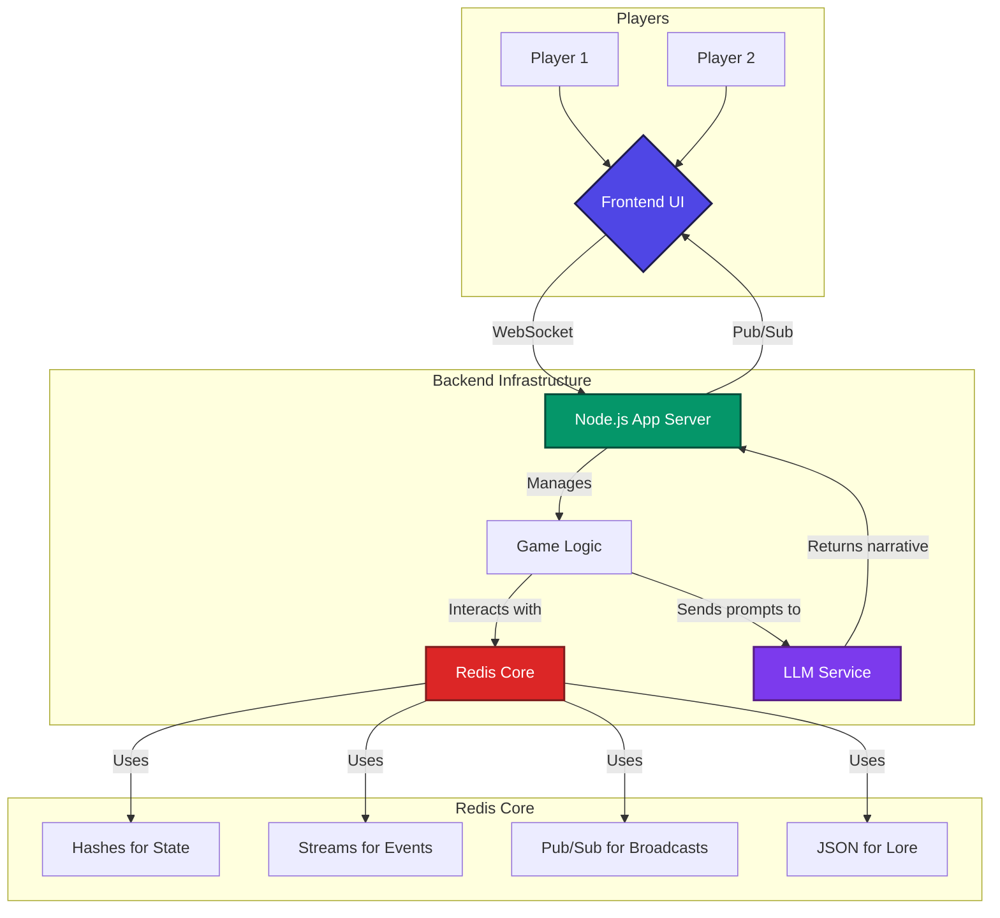
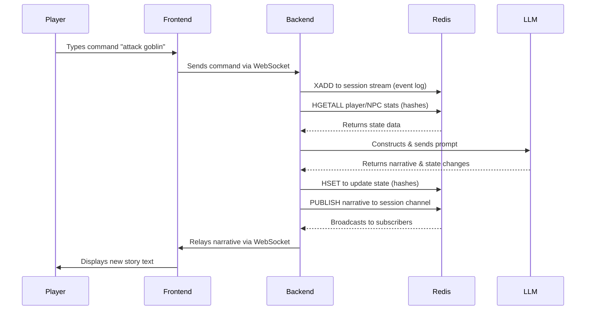
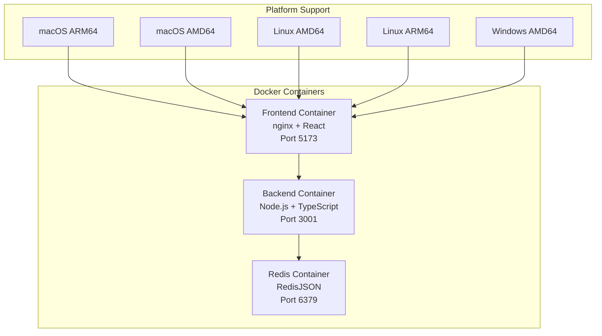

# 🐍 Real-Time AI Dungeon Master - Redis AI Challenge Submission

🚀 **AI-powered collaborative storytelling through real-time multiplayer adventures!** Built entirely around **Redis** as the high-performance real-time data layer, this project pushes the boundaries of interactive AI gaming.

> **Real-Time AI Dungeon Master** - The ultimate AI-powered multiplayer game, leveraging Redis for seamless real-time state management and dynamic storytelling.

**Built for the [Redis AI Challenge](https://dev.to/challenges/redis-2025-07-23?)** 🏆

> Competing in the **"Real-Time AI Innovators"** challenge prompt, demonstrating how Redis accelerates the future of AI through high-impact use cases like real-time feature streaming, semantic caching, and advanced state management.

## 📋 Table of Contents

- [🎯 Project Overview](#-project-overview)
- [Features](#features)
- [Architecture](#architecture)
- [🧠 Semantic Lore System](#-semantic-lore-system)
- [Prerequisites](#prerequisites)
- [Quick Start](#quick-start)
- [🏗️ Service Architecture & Container Details](#️-service-architecture--container-details)
- [Docker Deployment](#docker-deployment)
- [API Endpoints](#api-endpoints)
- [Development](#development)
- [Project Structure](#project-structure)
- [Redis Data Structures](#redis-data-structures)
- [🔧 Redis CLI Commands & Data Access](#-redis-cli-commands--data-access)
- [📊 Real Redis Data Examples](#-real-redis-data-examples)
- [🔍 Understanding Redis Data Structure](#-understanding-redis-data-structure)
- [📈 Data Analysis Insights](#-data-analysis-insights)
- [📋 Redis Command Summary](#-redis-command-summary)
- [Environment Variables](#environment-variables)
- [🔍 Troubleshooting](#-troubleshooting)
- [Contributing](#contributing)
- [Support](#support)

## 🎯 Project Overview

This project was built for the **[Redis AI Challenge](https://dev.to/challenges/redis-2025-07-23?)** for the **"Real-Time AI Innovators"** challenge prompt. The goal was to build an innovative AI-powered application using Redis as the real-time data layer, going beyond simple chatbots to explore high-impact use cases like real-time multiplayer gaming with AI-driven storytelling.

### Challenge Submission Details

- **Challenge:** Redis AI Challenge
- **Prompt:** Real-Time AI Innovators
- **Focus:** Real-time multiplayer AI dungeon master using Redis for state management, event streaming, and pub/sub broadcasting
- **Technology Stack:** Redis, Node.js, React, OpenAI API, Socket.IO, Docker, TypeScript, Tailwind CSS, Vite, nginx

### How This Project Demonstrates Redis AI Innovation

This project showcases how Redis accelerates the future of AI by implementing several high-impact use cases:

#### **1. Real-Time Feature Streaming for ML Workflows**

- **Redis Streams (XADD, XRANGE)** capture every player action as immutable events
- **Real-time event processing** feeds AI context for intelligent responses
- **Continuous learning** from player interactions to improve storytelling

#### **2. Semantic Caching to Optimize LLM Performance**

- **Redis Hashes (HSET, HGETALL)** store game state and context for rapid retrieval
- **Intelligent prompt construction** using cached game history
- **Reduced API calls** through context-aware response generation

#### **3. Real-Time State Management for AI Applications**

- **Redis Pub/Sub (PUBLISH, SUBSCRIBE)** enables instant narrative broadcasting to all players
- **Synchronized game state** across multiple players in real-time
- **Zero-latency updates** for immersive multiplayer experiences

#### **4. Advanced Redis Data Structures for AI Applications**

- **Redis Sets** track active players in each session with `SADD`, `SREM`, `SCARD`
- **Redis Keys** enable session discovery with pattern matching (`KEYS game:*:state`)
- **Redis DEL** provides session cleanup and data management
- **Redis JSON** powers semantic lore search with embeddings
- **Redis Connection Management** with dual clients (main + subscriber) for optimal performance

#### **5. Semantic Lore System for Enhanced AI Context**

- **Redis JSON (JSON.SET, JSON.GET)** stores AI-generated lore with embeddings
- **Semantic similarity search** using cosine similarity for contextual responses
- **Multi-type lore management** (characters, locations, items, world rules, quests)
- **Tag-based indexing** for efficient lore retrieval and categorization
- **Contextual AI responses** that reference relevant lore based on player actions

> **Note**: For detailed Redis feature descriptions, see the [Features](#features) section below.

#### **6. Beyond Simple Chatbots**

- **Complex game logic** with persistent world state
- **Multiplayer coordination** with real-time player tracking
- **Dynamic storytelling** that adapts to collective player actions
- **Session persistence** with automatic rejoining capabilities
- **Semantic search** for contextual AI responses

This demonstrates how Redis can power sophisticated AI applications that go far beyond simple question-answer interactions, creating truly interactive and collaborative AI experiences.

### 🏆 Redis AI Challenge Impact

This project was specifically built for the **[Redis AI Challenge](https://dev.to/challenges/redis-2025-07-23?)** and demonstrates several key innovations in AI-powered applications using Redis:

#### **Challenge Alignment**

- **Challenge**: Redis AI Challenge
- **Prompt**: Real-Time AI Innovators
- **Focus**: Real-time multiplayer AI dungeon master using Redis for state management, event streaming, and pub/sub broadcasting
- **Technology Stack**: Redis, Node.js, React, OpenAI API, Socket.IO, Docker, TypeScript, Tailwind CSS, Vite, nginx

#### **Key Innovations**

This project showcases how Redis accelerates the future of AI through:

- **Real-time multiplayer gaming** with instant state synchronization
- **Semantic lore system** with AI-powered contextual responses
- **Event streaming** for complete game history and replay capability
- **Advanced Redis data structures** (Streams, Hashes, Sets, JSON) for optimal performance
- **Beyond simple chatbots** - creating truly interactive AI experiences

## Features

### Core Game Features

- **Real-time Multiplayer**: Multiple players can join the same game session
- **AI Dungeon Master**: Powered by OpenAI GPT models for dynamic storytelling
- **Session Management**: Create and join game sessions via unique URLs
- **Session Discovery**: Browse and join active sessions with player counts
- **Session Persistence**: Automatic rejoining via localStorage and URL parameters
- **Session Deletion**: Remove inactive or unwanted sessions

### Redis-Powered Infrastructure

- **Redis Streams (XADD, XRANGE)**: Immutable event logging for game history
  - Captures every player action as immutable events
  - Enables complete game history and replay capability
  - Feeds AI context for intelligent responses
- **Redis Hashes (HSET, HGETALL)**: Fast game state management and caching
  - Stores game state and context for rapid retrieval
  - Enables intelligent prompt construction using cached game history
  - Reduces API calls through context-aware response generation
- **Redis Pub/Sub (PUBLISH, SUBSCRIBE)**: Real-time narrative broadcasting
  - Enables instant narrative broadcasting to all players
  - Synchronizes game state across multiple players in real-time
  - Provides zero-latency updates for immersive multiplayer experiences
- **Redis Sets (SADD, SREM, SCARD)**: Player tracking and session management
  - Tracks active players in each session
  - Enables session discovery with pattern matching
- **Redis Keys (KEYS)**: Session discovery with pattern matching
  - Enables session browser functionality
  - Provides session cleanup and data management
- **Redis DEL**: Session cleanup and data management
  - Removes all session data when deleting
  - Enables automatic cleanup of inactive sessions
- **Redis JSON (JSON.SET, JSON.GET)**: Semantic lore system with embeddings
  - Powers semantic lore search with embeddings
  - Enables semantic similarity search using cosine similarity
  - Provides multi-type lore management (characters, locations, items, world rules, quests)
  - Supports tag-based indexing for efficient lore retrieval and categorization

### Real-Time Communication

- **WebSocket Communication**: Real-time updates across all connected players
- **Cross-platform Synchronization**: All players see the same game state
- **Zero-latency Updates**: Immersive multiplayer experiences
- **Connection Recovery**: Automatic reconnection with session preservation

### AI Integration

- **Context-Aware Storytelling**: AI adapts to collective player actions
- **Multi-session AI Context**: Session-specific prompts and responses
- **Fallback Responses**: Graceful handling when AI services are unavailable
- **Error-Specific Handling**: Rate limits, quotas, and network issues
- **Real-time Narrative Generation**: Immediate broadcasting to all players
- **Semantic Lore System**: AI-generated lore with semantic search capabilities
- **Contextual AI Responses**: References relevant lore based on player actions

### Production-Ready Features

- **Docker Containerization**: Scalable deployment with docker-compose
- **Health Monitoring**: Redis connection status and system health checks
- **Rate Limiting**: Prevents AI API abuse and ensures fair usage
- **Error Handling**: Graceful degradation with comprehensive error messages
- **Environment Validation**: Pre-startup validation of all required services
- **Graceful Shutdown**: Proper cleanup of connections and resources

### User Experience

- **Modern UI**: Beautiful React interface with Tailwind CSS
- **Theme Support**: Dark/light mode with theme persistence
- **Toast Notifications**: User feedback for all actions
- **Loading States**: Visual feedback during AI processing
- **Error Boundaries**: Crash protection and recovery
- **Responsive Design**: Works on desktop and mobile devices

### Advanced Features

- **Player-Driven Narrative**: Collective actions influence the story
- **Real-time Collaboration**: Shared storytelling experiences
- **Event History Preservation**: Complete game state replay capability
- **Session State Caching**: Instant game resumption
- **Player Context Preservation**: Maintains context across reconnections
- **Semantic Lore Search**: AI-powered contextual responses using embeddings
- **Multi-type Lore Management**: Characters, locations, items, world rules, and quests
- **Tag-based Lore Indexing**: Efficient categorization and retrieval system

## Architecture

### System Architecture



### Data Flow (A Single Turn)



### Docker Architecture Flow

The application uses a **multi-container Docker setup** with nginx as a reverse proxy:

```flow
┌─────────────┐    ┌─────────────┐    ┌─────────────┐
│   Browser   │───►│   nginx     │───►│   React     │
│             │    │  (frontend) │    │   (frontend)│
└─────────────┘    └─────────────┘    └─────────────┘
                           │
                           ▼
                    ┌─────────────┐    ┌─────────────┐
                    │   Backend   │◄──►│    Redis    │
                    │  (Node.js)  │    │   (Cache)   │
                    └─────────────┘    └─────────────┘
```

**Container Details:**

- **Frontend Container (nginx-based)**: Multi-stage build serving React app with API proxying
- **Backend Container (Node.js)**: Express server with Socket.IO for real-time communication
- **Redis Container**: In-memory data store with RedisJSON module for advanced features

## 🧠 Semantic Lore System

The application includes a sophisticated semantic lore system that enhances AI responses with contextual knowledge:

### Lore Types

- **Characters**: NPCs, allies, enemies, and their backstories
- **Locations**: Places, dungeons, cities, and their descriptions
- **Items**: Weapons, artifacts, magical objects, and their properties
- **World Rules**: Magic systems, laws, customs, and game mechanics
- **Quests**: Missions, objectives, and storylines

### Semantic Search Features

- **Embedding Generation**: Uses OpenAI's text-embedding-3-small model
- **Cosine Similarity**: Finds most relevant lore based on semantic similarity
- **Contextual Retrieval**: Automatically selects relevant lore for AI responses
- **Tag-based Indexing**: Efficient categorization and filtering
- **Multi-type Search**: Search across all lore types or filter by specific type

### Redis JSON Integration

- **JSON.SET**: Stores lore entries with embeddings and metadata
- **JSON.GET**: Retrieves complete lore entries with all fields
- **Type Indexing**: Uses Redis Sets for efficient type-based queries
- **Tag Indexing**: Uses Redis Sets for tag-based filtering
- **Pattern Matching**: Uses KEYS for flexible lore discovery

### Contextual AI Enhancement

- **Automatic Lore Selection**: AI responses include relevant lore context
- **Dynamic Storytelling**: Lore influences narrative generation
- **Consistent World Building**: Maintains lore consistency across sessions
- **Player-Driven Discovery**: Lore reveals based on player actions

## Prerequisites

- Node.js 18+
- Redis 7+ (with RedisJSON module)
- OpenAI API Key

## Quick Start

### Option 1: Docker Compose (Recommended - Easiest)

```bash
# 1. Clone the Repository
git clone https://github.com/ntanwir10/realtime_ai_dungeon_master
cd realtime_ai_dungeon_master

# 2. Set Up Environment Variables
cp backend/.env.example backend/.env
# Edit backend/.env and add your OpenAI API key

# 3. Start Everything with Docker
docker-compose up --build

# 4. Access the Application
# Frontend: http://localhost:5173
# Backend API: http://localhost:3001
# Redis: localhost:6379
```

**What this starts:**

- ✅ **Redis** with RedisJSON module (port 6379)
- ✅ **Backend** Node.js server (port 3001)
- ✅ **Frontend** React app with nginx (port 5173)
- ✅ **All networking** between containers

### Option 2: Manual Development Setup

```bash
# 1. Clone the Repository
git clone https://github.com/ntanwir10/realtime_ai_dungeon_master
cd realtime_ai_dungeon_master

# 2. Set Up Environment Variables
cp backend/.env.example backend/.env
# Edit backend/.env and add your OpenAI API key

# 3. Install Dependencies
cd backend && npm install
cd ../frontend && npm install

# 4. Start Redis with RedisJSON
docker run -d -p 6379:6379 redislabs/rejson:latest

# 5. Start the Application
# Terminal 1 - Backend
cd backend
npm run dev

# Terminal 2 - Frontend
cd frontend
npm run dev

# 6. Access the Application
# Frontend: http://localhost:5173
# Backend API: http://localhost:3001
```

### Docker Commands

```bash
# Start all services
docker-compose up --build

# Start in background
docker-compose up -d --build

# Stop all services
docker-compose down

# View logs
docker-compose logs -f

# Restart specific service
docker-compose restart backend
```

## 🏗️ Service Architecture & Container Details

### **Redis Container**

- **Port**: 6379
- **Image**: `redislabs/rejson:latest`
- **Purpose**: Database with RedisJSON module
- **Data**: Game sessions, events, lore, player tracking
- **Features**: JSON storage, semantic search, pub/sub

### **Backend Container**

- **Port**: 3001
- **Image**: Custom Node.js/TypeScript
- **Purpose**: API server with Socket.IO
- **Features**: Game logic, AI integration, WebSocket handling
- **Health Check**: `http://localhost:3001/api/health`

### **Frontend Container**

- **Port**: 5173
- **Image**: nginx serving React app
- **Purpose**: Web interface
- **Features**: UI, WebSocket client, session management
- **Proxy**: Routes `/api/*` to backend, `/socket.io/*` to backend

### **Network Flow**

```flow
Browser → Frontend (5173) → Backend (3001) → Redis (6379)
```

## Docker Deployment

### 🐳 **OS-Agnostic Multi-Platform Docker Setup**

The application uses a **truly OS-agnostic multi-container Docker setup** that automatically adapts to any platform (macOS, Linux, Windows) without manual configuration.

#### **🏗️ Architecture Overview**



#### **🔧 Container Details**

##### **Frontend Container (nginx-based):**

- **Multi-stage build**: Builds React app with Node.js, serves with nginx
- **OS-agnostic**: Automatically uses host platform architecture
- **Port 5173**: Serves the React application
- **API Proxy**: Routes `/api/*` requests to backend
- **WebSocket Proxy**: Routes `/socket.io/*` to backend
- **SPA Support**: Handles client-side routing

##### **Backend Container (Node.js):**

- **Port 3001**: Express server with Socket.IO
- **TypeScript**: Direct execution with `tsx` (no compilation step)
- **Health checks**: Built-in monitoring and status endpoints
- **Redis integration**: Session and state management
- **Rate limiting**: IPv6-compatible rate limiting

##### **Redis Container:**

- **Port 6379**: In-memory data store with RedisJSON module
- **Session storage**: Game state and player data
- **Event streaming**: Real-time updates via Redis Streams
- **Lore system**: Semantic search with embeddings

### 🚀 **Multi-Platform Deployment Options**

#### **Option 1: Development (Single Platform)**

```bash
# Automatically uses host platform
docker-compose up --build

# Run in background
docker-compose up -d --build

# Stop services
docker-compose down
```

#### **Option 2: Production (Multi-Platform)**

```bash
# Build for all platforms using Docker Bake
docker buildx bake all

# Build specific services for all platforms
docker buildx bake backend-all
docker buildx bake frontend-all

# Build for specific platforms
docker buildx build --platform linux/amd64,linux/arm64 .
```

#### **Option 3: Manual Platform-Specific Builds**

```bash
# Backend for specific platform
docker buildx build --platform linux/amd64 -t ai-dungeon-backend ./backend

# Frontend for specific platform
docker buildx build --platform linux/arm64 -t ai-dungeon-frontend ./frontend
```

### 📋 **Docker Configuration Files**

#### **docker-compose.yml (Development)**

- **Automatic platform detection**: No fixed platform specifications
- **Service orchestration**: Redis, Backend, Frontend
- **Volume management**: Persistent Redis data
- **Health checks**: Built-in monitoring

#### **docker-compose.prod.yml (Production)**

- **Production optimizations**: Health checks, restart policies
- **Environment-specific**: Production environment variables
- **Service dependencies**: Proper startup order

#### **docker-bake.hcl (Multi-Platform)**

- **Docker Bake configuration**: Advanced build management
- **Platform targets**: linux/amd64, linux/arm64
- **Build optimization**: Parallel builds, caching
- **Production ready**: Optimized for deployment

### 🔧 **Dockerfile Details**

#### **Backend Dockerfile:**

```dockerfile
# OS-agnostic base image
FROM node:18-alpine AS base

# Multi-stage build for optimization
FROM base AS deps
# Install dependencies

FROM base AS runner
# Production image with TypeScript execution
CMD ["npx", "tsx", "src/server.ts"]
```

#### **Frontend Dockerfile:**

```dockerfile
# Build stage
FROM node:18-alpine AS builder
# Build React application

# Production stage
FROM nginx:alpine AS production
# Serve with nginx + API proxying
```

### 🌐 **Platform Support Matrix**

| Platform | Architecture          | Support  | Performance |
| -------- | --------------------- | -------- | ----------- |
| macOS    | ARM64 (Apple Silicon) | ✅ Native | ⭐⭐⭐⭐⭐       |
| macOS    | AMD64 (Intel)         | ✅ Native | ⭐⭐⭐⭐⭐       |
| Linux    | AMD64                 | ✅ Native | ⭐⭐⭐⭐⭐       |
| Linux    | ARM64                 | ✅ Native | ⭐⭐⭐⭐⭐       |
| Windows  | AMD64 (WSL2)          | ✅ Native | ⭐⭐⭐⭐        |
| Windows  | AMD64 (Native)        | ✅ Native | ⭐⭐⭐⭐        |

### 🎯 **Key Benefits**

#### **Automatic Platform Detection**

- **No manual configuration**: Works on any system out of the box
- **Native performance**: Uses host architecture for optimal speed
- **Future-proof**: Automatically supports new architectures

#### **Multi-Platform Deployment**

- **Single command**: `docker buildx bake all` builds for all platforms
- **Registry ready**: Push to Docker Hub for cross-platform distribution
- **CI/CD friendly**: Integrates with GitHub Actions, GitLab CI, etc.

#### **Development Experience**

- **Fast builds**: Local development uses host platform
- **Hot reloading**: TypeScript execution without compilation
- **Easy debugging**: Direct access to container logs

### 🔍 **Troubleshooting Docker Issues**

#### **Platform-Specific Issues**

```bash
# Check Docker platform support
docker buildx ls

# Create multi-platform builder
docker buildx create --name multiplatform --use

# Inspect image platforms
docker buildx imagetools inspect your-image:tag
```

#### **Build Issues**

```bash
# Clean Docker cache
docker system prune -a

# Rebuild without cache
docker-compose build --no-cache

# Check build logs
docker-compose logs --tail=100
```

#### **Runtime Issues**

```bash
# Check container health
docker-compose ps

# View container logs
docker-compose logs -f backend

# Access container shell
docker-compose exec backend sh
```

## API Endpoints

### REST API Endpoints

#### **Game Session Management**

##### `POST /api/game`

Creates a new game session.

**Request:**

```json
{
  // No body required
}
```

**Response:**

```json
{
  "success": true,
  "sessionId": "abc123def4",
  "message": "Game session created successfully"
}
```

**Response Fields:**

- `success` (boolean): Always `true` on successful creation
- `sessionId` (string): Unique 10-character alphanumeric session identifier
- `message` (string): Human-readable success message

**Error Response:**

```json
{
  "success": false,
  "message": "Failed to create game session",
  "error": "Internal server error"
}
```

**Error Fields:**

- `success` (boolean): Always `false` on error
- `message` (string): Human-readable error message
- `error` (string, optional): Detailed error in development mode

**Status Codes:**

- `201` - Session created successfully
- `500` - Internal server error

---

##### `GET /api/sessions`

Retrieves all active game sessions.

**Request:**

```rest
GET /api/sessions
```

**Query Parameters:**

- None required

**Response:**

```json
{
  "success": true,
  "sessions": [
    {
      "sessionId": "abc123def4",
      "playerCount": 2,
      "createdAt": 1703123456789,
      "lastActivity": 1703123456789
    }
  ]
}
```

**Response Fields:**

- `success` (boolean): Always `true` on successful retrieval
- `sessions` (array): Array of active session objects
  - `sessionId` (string): Unique session identifier
  - `playerCount` (number): Number of active players (0-10)
  - `createdAt` (number): Unix timestamp when session was created
  - `lastActivity` (number): Unix timestamp of last activity

**Error Response:**

```json
{
  "success": false,
  "message": "Failed to get active sessions"
}
```

**Status Codes:**

- `200` - Sessions retrieved successfully
- `500` - Internal server error

---

##### `GET /api/sessions/:sessionId`

Gets detailed information about a specific session.

**Request:**

```rest
GET /api/sessions/abc123def4
```

**Path Parameters:**

- `sessionId` (string, required): 10-character alphanumeric session identifier

**Response:**

```json
{
  "success": true,
  "session": {
    "sessionId": "abc123def4",
    "playerCount": 2,
    "createdAt": 1703123456789,
    "lastActivity": 1703123456789,
    "players": ["socket_id_1", "socket_id_2"],
    "gameState": {
      "narrative": "You find yourself in a dark cave...",
      "events": [
        {
          "id": "event_1",
          "playerId": "socket_id_1",
          "command": "explore the cave",
          "narrative": "As you explore the cave...",
          "timestamp": 1703123456789
        }
      ],
      "currentLocation": "Dark Cave Entrance",
      "inventory": ["torch", "rope"],
      "health": 100,
      "experience": 50
    }
  }
}
```

**Response Fields:**

- `success` (boolean): Always `true` on successful retrieval
- `session` (object): Detailed session information
  - `sessionId` (string): Unique session identifier
  - `playerCount` (number): Number of active players
  - `createdAt` (number): Unix timestamp when session was created
  - `lastActivity` (number): Unix timestamp of last activity
  - `players` (array): Array of connected player socket IDs
  - `gameState` (object): Current game state
    - `narrative` (string): Current story narrative
    - `events` (array): Array of game events (max 50)
    - `currentLocation` (string): Player's current location
    - `inventory` (array): Player's inventory items
    - `health` (number): Player's health points (0-100)
    - `experience` (number): Player's experience points

**Error Response (404):**

```json
{
  "success": false,
  "message": "Session not found"
}
```

**Status Codes:**

- `200` - Session details retrieved successfully
- `404` - Session not found
- `500` - Internal server error

---

##### `DELETE /api/sessions/:sessionId`

Deletes a specific game session.

**Request:**

```rest
DELETE /api/sessions/abc123def4
```

**Path Parameters:**

- `sessionId` (string, required): 10-character alphanumeric session identifier

**Response:**

```json
{
  "success": true,
  "message": "Session deleted successfully"
}
```

**Response Fields:**

- `success` (boolean): Always `true` on successful deletion
- `message` (string): Human-readable success message

**Error Response (404):**

```json
{
  "success": false,
  "message": "Session not found"
}
```

**Status Codes:**

- `200` - Session deleted successfully
- `404` - Session not found
- `500` - Internal server error

---

#### **Health Check**

##### `GET /api/health`

System health check endpoint.

**Request:**

```rest
GET /api/health
```

**Response:**

```json
{
  "status": "healthy",
  "timestamp": "2024-01-15T10:30:45.123Z",
  "uptime": 3600.5,
  "redis": "connected",
  "environment": "production",
  "version": "1.0.0"
}
```

**Response Fields:**

- `status` (string): Health status (`healthy` or `unhealthy`)
- `timestamp` (string): ISO 8601 timestamp of health check
- `uptime` (number): Server uptime in seconds
- `redis` (string): Redis connection status (`connected` or `disconnected`)
- `environment` (string): Current environment (`development`, `production`, etc.)
- `version` (string): Application version

**Error Response (503):**

```json
{
  "status": "unhealthy",
  "timestamp": "2024-01-15T10:30:45.123Z",
  "error": "Redis connection failed"
}
```

**Status Codes:**

- `200` - System healthy
- `503` - System unhealthy

---

### WebSocket Events

The application uses Socket.IO for real-time communication. All events are prefixed with `game:`.

#### **Client to Server Events**

##### `game:join`

Join a game session.

**Request:**

```json
{
  "sessionId": "abc123def4"
}
```

**Request Fields:**

- `sessionId` (string, required): 10-character alphanumeric session identifier

**Validation Rules:**

- `sessionId` must be exactly 10 characters
- `sessionId` must be alphanumeric only
- Session must exist and be active

**Server Response:**

```json
{
  "sessionId": "abc123def4",
  "playerId": "socket_id_123",
  "timestamp": 1703123456789
}
```

**Response Fields:**

- `sessionId` (string): The session ID that was joined
- `playerId` (string): Unique socket ID for this player
- `timestamp` (number): Unix timestamp of join event

**Error Response:**

```json
{
  "message": "Session not found or inactive",
  "timestamp": 1703123456789
}
```

---

##### `game:command`

Send a command to the AI Dungeon Master.

**Request:**

```json
{
  "command": "explore the cave entrance"
}
```

**Request Fields:**

- `command` (string, required): Player's action command

**Validation Rules:**

- `command` must be non-empty string
- `command` must be trimmed of whitespace
- `command` maximum length: 1000 characters
- Player must be joined to a session

**Server Response:**

- No direct response
- AI narrative is broadcast via `game:update` event

**Error Response:**

```json
{
  "message": "Command cannot be empty",
  "timestamp": 1703123456789
}
```

---

#### **Server to Client Events**

##### `game:joined`

Confirmation that player successfully joined a session.

**Event:**

```json
{
  "sessionId": "abc123def4",
  "playerId": "socket_id_123",
  "timestamp": 1703123456789
}
```

**Event Fields:**

- `sessionId` (string): The session ID that was joined
- `playerId` (string): Unique socket ID for this player
- `timestamp` (number): Unix timestamp of join event

---

##### `game:player_joined`

Notification when another player joins the session.

**Event:**

```json
{
  "playerId": "socket_id_456",
  "sessionId": "abc123def4",
  "timestamp": 1703123456789
}
```

**Event Fields:**

- `playerId` (string): Socket ID of the player who joined
- `sessionId` (string): Session ID where player joined
- `timestamp` (number): Unix timestamp of join event

---

##### `game:player_left`

Notification when a player leaves the session.

**Event:**

```json
{
  "playerId": "socket_id_456",
  "sessionId": "abc123def4",
  "timestamp": 1703123456789
}
```

**Event Fields:**

- `playerId` (string): Socket ID of the player who left
- `sessionId` (string): Session ID where player left
- `timestamp` (number): Unix timestamp of leave event

---

##### `game:update`

AI narrative response broadcast to all players in the session.

**Event:**

```json
{
  "sessionId": "abc123def4",
  "narrative": "As you explore the cave entrance, you notice ancient runes carved into the stone walls. The air is thick with mystery and the faint sound of dripping water echoes from deeper within the cavern.",
  "playerId": "socket_id_123",
  "command": "explore the cave entrance",
  "timestamp": 1703123456789,
  "gameState": {
    "currentLocation": "Cave Entrance",
    "inventory": ["torch", "rope", "ancient key"],
    "health": 95,
    "experience": 75
  }
}
```

**Event Fields:**

- `sessionId` (string): Session ID where update occurred
- `narrative` (string): AI-generated story response (max 2000 characters)
- `playerId` (string): Socket ID of player who sent the command
- `command` (string): Original command that triggered the response
- `timestamp` (number): Unix timestamp of update event
- `gameState` (object, optional): Updated game state
  - `currentLocation` (string): Player's current location
  - `inventory` (array): Player's inventory items
  - `health` (number): Player's health points (0-100)
  - `experience` (number): Player's experience points

---

##### `game:error`

Error notification for various game-related issues.

**Event:**

```json
{
  "message": "Failed to process command. Please try again.",
  "timestamp": 1703123456789,
  "errorCode": "COMMAND_PROCESSING_ERROR"
}
```

**Event Fields:**

- `message` (string): Human-readable error message
- `timestamp` (number): Unix timestamp of error event
- `errorCode` (string, optional): Machine-readable error code

**Common Error Codes:**

- `SESSION_NOT_FOUND` - Session doesn't exist
- `COMMAND_PROCESSING_ERROR` - AI processing failed
- `RATE_LIMIT_EXCEEDED` - Too many commands
- `INVALID_COMMAND` - Command validation failed
- `CONNECTION_ERROR` - WebSocket connection issue

---

### Error Handling

All API endpoints return consistent error responses:

**HTTP Error Responses:**

- `400` - Bad Request (invalid parameters)

  ```json
  {
    "success": false,
    "message": "Invalid session ID format",
    "error": "Session ID must be exactly 10 characters"
  }
  ```

- `404` - Not Found (session doesn't exist)

  ```json
  {
    "success": false,
    "message": "Session not found"
  }
  ```

- `429` - Too Many Requests (rate limit exceeded)

  ```json
  {
    "success": false,
    "message": "Too many requests from this IP, please try again later.",
    "retryAfter": 900
  }
  ```

- `500` - Internal Server Error

  ```json
  {
    "success": false,
    "message": "Internal server error",
    "error": "Database connection failed"
  }
  ```

- `503` - Service Unavailable (health check failures)

  ```json
  {
    "status": "unhealthy",
    "timestamp": "2024-01-15T10:30:45.123Z",
    "error": "Redis connection failed"
  }
  ```

**Rate Limiting:**

- 100 requests per 15 minutes per IP address
- Returns `429` status with retry information
- Applies to all REST API endpoints
- WebSocket events have separate rate limiting

**WebSocket Error Handling:**

- Connection errors are handled gracefully
- Automatic reconnection attempts (exponential backoff)
- Session state is preserved during disconnections
- Error events include error codes for programmatic handling

---

### Authentication & Security

**CORS Configuration:**

- Configured for development and production origins
- Supports credentials for authenticated requests
- Methods: GET, POST, DELETE, OPTIONS

**Rate Limiting:**

- Prevents abuse with configurable limits
- Separate limits for REST API and WebSocket events
- IP-based rate limiting with configurable windows

**Input Validation:**

- All commands and session IDs are validated
- SQL injection protection through parameterized queries
- XSS protection through input sanitization
- Command length limits (1000 characters max)

**Error Sanitization:**

- Sensitive information is filtered in production
- Stack traces only shown in development mode
- Generic error messages in production

---

### WebSocket Connection Details

**Connection URL:** `ws://localhost:3001` (or your server URL)

**Connection Options:**

```javascript
const socket = io('http://localhost:3001', {
  transports: ['websocket', 'polling'],
  timeout: 60000,
  pingInterval: 25000,
  pingTimeout: 60000,
  reconnection: true,
  reconnectionAttempts: 5,
  reconnectionDelay: 1000,
  reconnectionDelayMax: 5000
});
```

**Connection States:**

- `connected` - Successfully connected to server
- `disconnected` - Connection lost
- `connecting` - Attempting to reconnect
- `error` - Connection error occurred

**Reconnection Behavior:**

- Automatic reconnection on connection loss
- Exponential backoff (1s, 2s, 4s, 8s, 16s)
- Maximum 5 reconnection attempts
- Session state preserved during reconnection

**Event Acknowledgment:**

```javascript
// Send command with acknowledgment
socket.emit('game:command', { command: 'explore cave' }, (response) => {
  if (response.success) {
    console.log('Command sent successfully');
  } else {
    console.error('Command failed:', response.message);
  }
});
```

## Development

### Backend Development

```bash
cd backend
npm run dev          # Start development server
npm run build        # Build for production
npm run test:phase1  # Run Phase 1 tests
```

### Frontend Development

```bash
cd frontend
npm run dev          # Start development server
npm run build        # Build for production
npm run preview      # Preview production build
```

## Project Structure

```tree
realtime_ai_dungeon_master/
├── backend/
│   ├── src/
│   │   ├── server.ts              # Express server with Socket.IO
│   │   ├── gameService.ts         # Game logic and AI integration
│   │   ├── loreService.ts         # Lore system with semantic search
│   │   ├── redisClient.ts         # Redis connection management
│   │   └── utils/
│   │       ├── envValidation.ts   # Environment validation utilities
│   │       ├── errorHandler.ts    # Error handling and logging
│   │       └── rateLimiter.ts    # Rate limiting with IPv6 support
│   ├── scripts/
│   │   ├── test_phase1.ts         # Phase 1 verification tests
│   │   └── test_complete.ts       # Complete implementation tests
│   ├── Dockerfile                 # Backend container configuration
│   ├── tsconfig.json              # TypeScript configuration
│   ├── .env.example               # Environment variables template
│   └── package.json
├── frontend/
│   ├── src/
│   │   ├── components/
│   │   │   ├── GameView.tsx       # Main game interface
│   │   │   ├── CommandInput.tsx   # Command input component
│   │   │   ├── StoryLog.tsx       # Story display component
│   │   │   ├── LandingPage.tsx    # Session management UI
│   │   │   ├── ErrorBoundary.tsx  # Error handling component
│   │   │   ├── ToastProvider.tsx  # Toast notifications
│   │   │   ├── theme-provider.tsx # Theme management
│   │   │   └── theme-toggle.tsx   # Theme toggle component
│   │   ├── @/components/ui/       # Reusable UI components
│   │   ├── types/
│   │   │   └── toast.ts           # Toast type definitions
│   │   ├── App.tsx                # Main application component
│   │   ├── main.tsx               # Application entry point
│   │   ├── index.css              # Global styles
│   │   └── App.css                # App-specific styles
│   ├── public/                    # Static assets
│   ├── Dockerfile                 # Frontend container configuration
│   ├── nginx.conf                 # Nginx configuration for production
│   ├── tsconfig.json              # TypeScript configuration
│   ├── vite.config.ts             # Vite configuration
│   ├── tailwind.config.js         # Tailwind CSS configuration
│   ├── postcss.config.js          # PostCSS configuration
│   ├── eslint.config.js           # ESLint configuration
│   └── package.json
├── docker-compose.yml             # Full stack deployment
├── .gitignore                     # Root gitignore
├── README.md                      # Main project documentation
```

## Redis Data Structures

### Game State (Hashes)

- `game:{sessionId}:state` - Current game state and metadata
  - `status`: Session status (active, ended)
  - `created_at`: Timestamp when session was created
  - `last_activity`: Timestamp of last activity

### Event Stream (Streams)

- `game:{sessionId}:events` - Immutable log of all game events
  - `playerId`: ID of the player who performed the action
  - `event`: JSON stringified event data
  - `timestamp`: When the event occurred

### Player Tracking (Sets)

- `game:{sessionId}:players` - Active players in the session
  - Uses `SADD` to add players
  - Uses `SREM` to remove players
  - Uses `SCARD` to count active players

### Pub/Sub Channels

- `game:{sessionId}:updates` - Real-time narrative broadcasts
  - JSON messages with narrative content
  - Broadcast to all players in the session

### Session Discovery

- Uses `KEYS game:*:state` to find all active sessions
- Pattern matching for session discovery
- Enables session browser functionality

### Data Management

- Uses `DEL` for session cleanup
- Removes all session data when deleting
- Automatic cleanup of inactive sessions

### Lore System (JSON)

- `lore:{id}` - AI-generated lore entries with embeddings
  - `id`: Unique lore identifier
  - `type`: Lore type (character, location, item, world_rule, quest)
  - `title`: Lore title
  - `content`: Detailed lore content
  - `embedding`: Vector embedding for semantic search
  - `tags`: Array of tags for categorization
  - `created_at`: Timestamp when lore was created
  - `updated_at`: Timestamp when lore was last updated

### Lore Indexing (Sets)

- `lore:type:{type}` - Index of lore entries by type
  - Uses `SADD` to add lore IDs to type index
  - Uses `SMEMBERS` to get all lore of a specific type
- `lore:tag:{tag}` - Index of lore entries by tag
  - Uses `SADD` to add lore IDs to tag index
  - Uses `SMEMBERS` to get all lore with a specific tag

## 🔧 Redis CLI Commands & Data Access

### Connect to Redis

```bash
# Connect to Docker Redis (if using docker-compose)
docker exec -it $(docker ps -q --filter "ancestor=redislabs/rejson") redis-cli

# Connect to local Redis
redis-cli

# Connect to Redis with password
redis-cli -a your_password

# Connect to remote Redis
redis-cli -h your_redis_host -p 6379
```

### Lore System Commands

```bash
# List all lore entries
KEYS lore:*

# Get lore by type
KEYS lore:world_rule_*

# View lore content
JSON.GET lore:world_rule_1703123456789_abc123

# Search lore by tag
KEYS lore:tag:magic

# Get all lore of a specific type
SMEMBERS lore:type:character

# Get all lore with a specific tag
SMEMBERS lore:tag:magic

# Test RedisJSON module
JSON.SET test $ '{"hello": "world"}'
JSON.GET test
```

### Game Session Commands

```bash
# List all active sessions
KEYS game:*:state

# Get session details
HGETALL game:abc123def4:state

# View session events
XRANGE game:abc123def4:events - + COUNT 20

# Check player count
SCARD game:abc123def4:players

# List all players in session
SMEMBERS game:abc123def4:players
```

### Data Cleanup Commands

```bash
# Delete specific session
DEL game:abc123def4:state game:abc123def4:events game:abc123def4:players

# Delete all sessions
DEL $(redis-cli KEYS "game:*")

# Clear all data (DANGER!)
FLUSHALL

# Check memory usage
INFO memory
```

### Monitoring & Debugging Commands

```bash
# Monitor all Redis commands in real-time
MONITOR

# Watch specific patterns
PSUBSCRIBE game:*:updates

# See database statistics
INFO keyspace

# Count all keys
DBSIZE

# See all Redis info
INFO

# Pretty print JSON (if you have jq installed)
redis-cli --raw JSON.GET lore:world_rule_1703123456789_abc123 | jq .

# Get specific session info
HGET game:97oZyf91Wr:state status

# Get session creation time
HGET game:97oZyf91Wr:state created_at

# Get last activity time
HGET game:97oZyf91Wr:state last_activity

# Count events in a session
XLEN game:97oZyf91Wr:events

# Get latest event only
XREVRANGE game:97oZyf91Wr:events + - COUNT 1
```

### Quick Reference Commands

```bash
# 1. Connect to Redis
docker exec -it $(docker ps -q --filter "ancestor=redislabs/rejson") redis-cli

# 2. See active sessions
KEYS game:*:state

# 3. Get session details
HGETALL game:abc123def4:state

# 4. See recent events
XRANGE game:abc123def4:events - + COUNT 5

# 5. Check players
SMEMBERS game:abc123def4:players

# 6. See lore entries
KEYS lore:*

# 7. View specific lore
JSON.GET lore:world_rule_1703123456789_abc123
```

## 📊 Real Redis Data Examples

### **Current Active Sessions**

```bash
# List all keys in Redis
redis-cli KEYS "*"
# Output:
# 1) "game:97oZyf91Wr:events"
# 2) "game:97oZyf91Wr:state"
# 3) "game:97oZyf91Wr:players"
# 4) "game:IXJCDOUBfw:state"
# 5) "game:IXJCDOUBfw:events"

# Total keys in database
redis-cli DBSIZE
# Output: (integer) 5
```

### **Session State Example**

```bash
# Get session details
redis-cli HGETALL "game:97oZyf91Wr:state"
# Output:
# 1) "status"
# 2) "active"
# 3) "created_at"
# 4) "1754535502551"
# 5) "last_activity"
# 6) "1754542615439"

# Explanation:
# - Session ID: 97oZyf91Wr
# - Status: active (session is currently running)
# - Created: January 6, 2025 at 12:25:02 UTC
# - Last Activity: January 6, 2025 at 14:30:15 UTC
```

### **Game Events Example**

```bash
# View recent events in a session
redis-cli XRANGE "game:97oZyf91Wr:events" - + COUNT 5
# Output:
# 1) 1) "1754535510729-0"
#    2) 1) "playerId"
#       2) "pGX0DZIp7ubmiV0aAAAG"
#       3) "event"
#       4) "{\"action\":\"command\",\"target\":\"check inventory\"}"
#       5) "timestamp"
#       6) "1754535510728"

# Explanation:
# - Event ID: 1754535510729-0 (timestamp-sequence)
# - Player ID: pGX0DZIp7ubmiV0aAAAG (Socket.IO socket ID)
# - Action: "check inventory" (player command)
# - Timestamp: January 6, 2025 at 12:25:10 UTC
```

### **Player Tracking Example**

```bash
# List all players in a session
redis-cli SMEMBERS "game:97oZyf91Wr:players"
# Output:
# 1) "artUPKpsNEKy4rEWAAAJ"
# 2) "dqg5atiR-udkCpCDAAAM"
# 3) "NV2U_rEpGCMJY3eEAAAM"

# Count players in session
redis-cli SCARD "game:97oZyf91Wr:players"
# Output: (integer) 3

# Explanation:
# - 3 active players in session 97oZyf91Wr
# - Each player has a unique Socket.IO socket ID
# - Players can join/leave dynamically
```

### **Memory Usage Example**

```bash
# Check Redis memory usage
redis-cli INFO memory
# Output:
# used_memory:987184
# used_memory_human:964.05K
# used_memory_rss:5488640
# used_memory_rss_human:5.23M
# mem_fragmentation_ratio:5.66

# Explanation:
# - Total memory used: 964.05K
# - RSS memory: 5.23M
# - Memory fragmentation: 5.66 (normal range)
# - Efficient memory usage for game data
```

### **Lore System Status**

```bash
# Check for lore entries
redis-cli KEYS "lore:*"
# Output: (empty array)

# Explanation:
# - No lore entries currently exist
# - Lore system is ready but not populated
# - Lore would be created as AI generates world content
```

### **Second Session Example**

```bash
# Get session details for second session
redis-cli HGETALL "game:IXJCDOUBfw:state"
# Output:
# 1) "status"
# 2) "active"
# 3) "created_at"
# 4) "1754542615441"
# 5) "last_activity"
# 6) "1754543782187"

# View events in second session
redis-cli XRANGE "game:IXJCDOUBfw:events" - + COUNT 3
# Output:
# 1) 1) "1754542631165-0"
#    2) 1) "playerId"
#       2) "NV2U_rEpGCMJY3eEAAAM"
#       3) "event"
#       4) "{\"action\":\"command\",\"target\":\"look around\"}"
#       5) "timestamp"
#       6) "1754542631164"
# 2) 1) "1754542637961-0"
#    2) 1) "playerId"
#       2) "NV2U_rEpGCMJY3eEAAAM"
#       3) "event"
#       4) "{\"action\":\"command\",\"target\":\"check inventory\"}"
#       5) "timestamp"
#       6) "1754542637960"
# 3) 1) "1754542646477-0"
#    2) 1) "playerId"
#       2) "NV2U_rEpGCMJY3eEAAAM"
#       3) "event"
#       4) "{\"action\":\"command\",\"target\":\"help\"}"
#       5) "timestamp"
#       6) "1754542646476"

# Check players in second session
redis-cli SMEMBERS "game:IXJCDOUBfw:players"
# Output: (empty array)

# Explanation:
# - Session IXJCDOUBfw is active but has no current players
# - Recent events show player commands: "look around", "check inventory", "help"
# - Player NV2U_rEpGCMJY3eEAAAM was active but may have disconnected
```

### **Database Statistics**

```bash
# Get keyspace information
redis-cli INFO keyspace
# Output:
# db0:keys=5,expires=0,avg_ttl=0,subexpiry=0

# Explanation:
# - 5 total keys in database
# - No expired keys (expires=0)
# - No TTL set on keys (avg_ttl=0)
# - Clean database state
```

### **Event Stream Analysis**

```bash
# Count events in first session
redis-cli XLEN "game:97oZyf91Wr:events"
# Output: (integer) 1

# Count events in second session
redis-cli XLEN "game:IXJCDOUBfw:events"
# Output: (integer) 4

# Get latest event from first session
redis-cli XREVRANGE "game:97oZyf91Wr:events" + - COUNT 1
# Output:
# 1) 1) "1754535510729-0"
#    2) 1) "playerId"
#       2) "pGX0DZIp7ubmiV0aAAAG"
#       3) "event"
#       4) "{\"action\":\"command\",\"target\":\"check inventory\"}"
#       5) "timestamp"
#       6) "1754535510728"

# Explanation:
# - Session 97oZyf91Wr: 1 event (single command)
# - Session IXJCDOUBfw: 4 events (more active)
# - Latest event: "check inventory" command
# - Event timestamps show recent activity
```

## 🔍 Understanding Redis Data Structure

### **Key Patterns**

- **Session Keys**: `game:{sessionId}:{type}`
  - `game:97oZyf91Wr:state` - Session metadata
  - `game:97oZyf91Wr:events` - Event stream
  - `game:97oZyf91Wr:players` - Player set

### **Session State Fields**

- `status`: "active" | "ended" - Session status
- `created_at`: Unix timestamp - When session was created
- `last_activity`: Unix timestamp - Last player activity

### **Event Stream Structure**

- **Event ID**: `{timestamp}-{sequence}` (e.g., "1754535510729-0")
- **Player ID**: Socket.IO socket identifier
- **Event Data**: JSON string with action and target
- **Timestamp**: Unix timestamp of event

### **Player Tracking**

- **Player IDs**: Socket.IO socket IDs (e.g., "artUPKpsNEKy4rEWAAAJ")
- **Dynamic Membership**: Players can join/leave anytime
- **Real-time Count**: Use SCARD for current player count

### **Memory Efficiency**

- **Small Footprint**: ~964KB for 2 active sessions
- **Efficient Storage**: Redis streams for events, sets for players
- **Fast Access**: O(1) lookups for session state and player counts

## 📈 Data Analysis Insights

### **Session Patterns**

- **Active Sessions**: 2 sessions currently running
- **Session Duration**: Sessions created ~2 hours ago, still active
- **Player Activity**: One session has 3 players, another has 0 (disconnected)
- **Command Types**: "check inventory", "look around", "help" commands

### **Event Stream Analysis**

- **Event Frequency**: Regular player activity with timestamps
- **Command Variety**: Different types of player actions
- **Player Engagement**: Active players using various commands
- **Session Persistence**: Events preserved even when players disconnect

### **Performance Metrics**

- **Memory Usage**: 964KB for 2 sessions (very efficient)
- **Key Count**: 5 keys total (clean database)
- **No Expired Keys**: Clean state, no TTL issues
- **Fast Access**: O(1) operations for all queries

## 📋 Redis Command Summary

### **Session Management**

| Command                       | Purpose             | Example                 |
| ----------------------------- | ------------------- | ----------------------- |
| `KEYS game:*:state`           | List all sessions   | `game:97oZyf91Wr:state` |
| `HGETALL game:{id}:state`     | Get session details | Status, timestamps      |
| `HGET game:{id}:state status` | Get session status  | "active" or "ended"     |

### **Event Tracking**

| Command                                  | Purpose         | Example             |
| ---------------------------------------- | --------------- | ------------------- |
| `XRANGE game:{id}:events - +`            | View all events | Player commands     |
| `XLEN game:{id}:events`                  | Count events    | `(integer) 4`       |
| `XREVRANGE game:{id}:events + - COUNT 1` | Latest event    | Most recent command |

### **Player Management**

| Command                             | Purpose       | Example       |
| ----------------------------------- | ------------- | ------------- |
| `SMEMBERS game:{id}:players`        | List players  | Socket IDs    |
| `SCARD game:{id}:players`           | Count players | `(integer) 3` |
| `SADD game:{id}:players {playerId}` | Add player    | Join session  |
| `SREM game:{id}:players {playerId}` | Remove player | Leave session |

### **System Monitoring**

| Command         | Purpose            | Example            |
| --------------- | ------------------ | ------------------ |
| `DBSIZE`        | Total keys         | `(integer) 5`      |
| `INFO memory`   | Memory usage       | `964.05K`          |
| `INFO keyspace` | Database stats     | `keys=5,expires=0` |
| `MONITOR`       | Real-time activity | Watch commands     |

### **Data Management**

| Command           | Purpose        | Example                         |
| ----------------- | -------------- | ------------------------------- |
| `DEL game:{id}:*` | Delete session | Remove all session data         |
| `FLUSHALL`        | Clear all data | **DANGER** - removes everything |
| `KEYS "*"`        | List all keys  | See entire database             |

## Environment Variables

### Backend (.env)

```env
REDIS_URL=redis://localhost:6379
PORT=3001
NODE_ENV=development
OPENAI_API_KEY=your_openai_api_key_here
```

### Frontend (.env)

```env
VITE_API_URL=http://localhost:3001
```

## 🔍 Troubleshooting

### Startup Issues

#### **Docker Compose Fails to Start**

```bash
# Check if ports are available
lsof -ti:3001,5173,6379

# Clean up and restart
docker-compose down
docker system prune -f
docker-compose up --build

# Check Docker logs
docker-compose logs
```

#### **Redis Connection Issues**

```bash
# Check if Redis is running
redis-cli PING

# Check Redis logs
docker logs $(docker ps -q --filter "ancestor=redislabs/rejson")

# Test RedisJSON module
redis-cli JSON.SET test $ '{"hello": "world"}'
```

#### **Backend Won't Start**

```bash
# Check if port 3001 is in use
lsof -ti:3001

# Kill process using port 3001
sudo lsof -ti:3001 | xargs kill -9

# Check backend logs
docker-compose logs backend
```

#### **Frontend Won't Load**

```bash
# Check if port 5173 is in use
lsof -ti:5173

# Check frontend logs
docker-compose logs frontend

# Test nginx configuration
docker exec -it $(docker ps -q --filter "ancestor=ai-dungeon-frontend") nginx -t
```

### Lore System Issues

```bash
# Test RedisJSON functionality
redis-cli JSON.SET lore:test $ '{"id": "test", "type": "test", "title": "Test"}'
redis-cli JSON.GET lore:test

# Check if lore entries exist
KEYS lore:*

# Verify lore type indexing
SMEMBERS lore:type:world_rule
```

### Port Already in Use

```bash
# Find processes using port 3001
lsof -ti:3001

# Kill any process using port 3001
sudo lsof -ti:3001 | xargs kill -9

# Or kill Node.js processes
pkill -f "tsx src/server.ts"
```

## Contributing

1. Fork the repository
2. Create a feature branch
3. Make your changes
4. Add tests if applicable
5. Submit a pull request

## Support

For issues and questions, please open an issue on GitHub.


